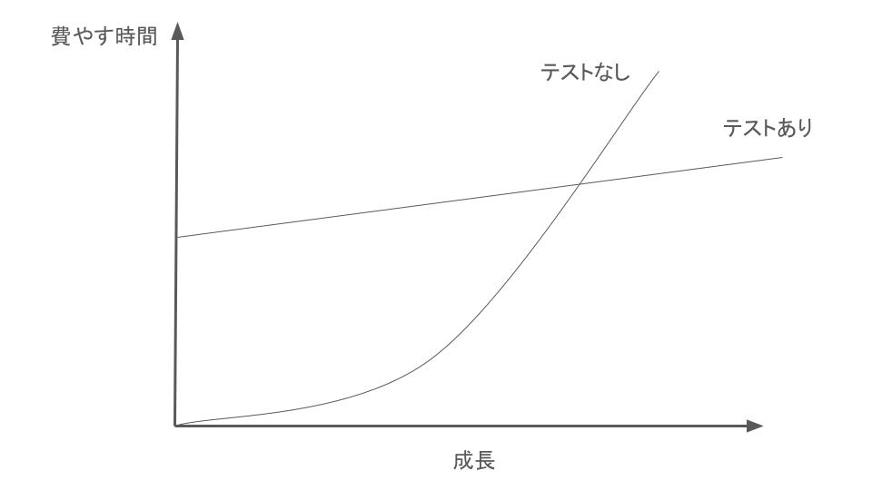

author: shogo.yamada
summary: 「単体テストの考え方/使い方」という本から作成したcolab
id: original_unit_test_colab
categories: codelab,markdown
environments: Web
status: Draft
feedback link: https://github.com/yshogo
analytics account: XXXXXXXX

# Codelab: Jetpack Composeでの単体テスト学習

## はじめに

このCodelabでは、「単体テストの考え方/使い方」という本の内容に基づき、Androidアプリの開発における単体テストの基礎を学びます。本Codelabでは特に、Jetpack Composeを用いたサンプルコードを使用して、実際にどのようにテストを実装するかを解説していきます。


<aside class="negative">
注意：
このCodelabは著者山田の解釈を元に作成されていますが、必ずしも本の内容を網羅しているわけではありません。
また、解釈に誤りが含まれている可能性もあります。そのため、このCodelabを通じて基本的な理解を深めるだけでなく、必ず原書も併せてお読みいただき、より深い理解を得ていただくことを推奨します。
</aside>

### 目的

このCodelabの目的は、Jetpack Composeを活用したテストの実装方法を学ぶことです。基本的なテストの考え方を学ぶだけでなく、実際の開発にすぐに応用できるテクニックも紹介します。

### 対象読者

- Android開発に携わっている方
- 単体テストの基本的な概念を学びたい方

### 前提条件

- Android開発環境が整っていること
- Kotlinの基本的な知識があること
- Jetpack Composeの基本的な使い方を理解していること

### 必要なもの
- Android 開発に関する基本的な知識
- Android Studio（まだお持ちでない場合は[こちら](https://developer.android.com/studio/?hl=ja)からダウンロードしてください）
- Android Emulator または Android デバイス（Android Studio から入手可能）
- サンプルコード（次の手順を参照）

## Step 1: 単体テストの目的
ソフトウェア開発において、単体テストの第一の目的はコード設計を改善することではなく、プロジェクトを**持続可能**なものにすることです。この「持続可能性」が重要な理由は、ソフトウェアは新しい機能や変更が加わるごとに自然と複雑さが増していき、保守性が低下しやすくなるためです。この複雑化（エントロピー）の進行を防ぐために、単体テストはコードの変更が意図しない影響を与えていないかを確認する「セーフティネット」としての役割を果たします。

### ソフトウェアエントロピーと単体テストの役割
**ソフトウェアエントロピー**は、機能追加や改良を行うたびにコードが複雑化し、保守が難しくなる現象を指します。単体テストはこのエントロピーを防ぎ、コードが安定した状態を保つことに貢献します。単体テストの準備には初期の労力が必要ですが、その労力は後々のデバッグや修正の回数を減らすことで、開発効率と保守性を向上させます。



<aside class="positive">
例え話

単体テストは、部屋の大掃除に似ています。最初に時間をかけて徹底的に整理整頓するのは大変ですが、きちんと片付けをしておけば、後々は少しの手間で綺麗な状態を維持できるようになります。同様に、プロジェクトに最初から十分な単体テストを導入することで、最初は時間と労力が必要でも、長期的にはコードの保守が格段に楽になります。例えば、プロダクションコードのリファクタリング時にテストコードも見直し、テストが失敗した際はその原因をすぐに修正するなどの作業を通じて、テストの価値が維持され、コード全体の品質も安定します。しかし、適切なテスト設計やメンテナンスを怠ると、まるで片付けが進まない部屋のように、コードも複雑さとエラーが蓄積し、最終的にはプロジェクト全体が重荷になってしまうのです。
</aside>

### 単体テストの価値と保守コストのバランス

単体テストは、コードの品質を保ちながら開発を進める上で重要ですが、テストの価値を発揮するためには単体テストの価値と保守コストの両方を考慮しなければなりません。
そしてこのコストは下記に挙げるさまざまな作業で費やされる時間が積み重なることで増加していきます。

- プロダクションコードのリファクタリングに伴ってテスト・コードをリファクタリングすること
- プロダクションコードを変更するたびにテストを実施すること
- テストが間違って失敗した際にその対処をすること
- プロダクションコードがどのように振る舞うのかを理解するためにテストコードを読むこと

これらの要点を押さえて、テストスイートを設計することで、持続可能でプロジェクト全体に貢献する価値あるテストを設計することができます。
作成した単体テストへの保守コストがあまりにもかかりすぎると、その単体テストの価値がなくなってしまう、もしくはマイナスになってしまうことがあります。

### コードカバレッジとテストの質
コードカバレッジ（テスト実行中に実行されるコード行の割合）は、テストスイートの品質を測る指標として使用されることが多いですが、**カバレッジだけではテストの質は保証できません**。カバレッジに過度にこだわると、カバレッジを上げるためだけに表面的なテストや冗長なテストを書く傾向が生まれることがあります。良質なテストは、カバレッジに頼るのではなく、ビジネスロジックのように失敗の影響が大きい部分に焦点を当てるべきです。

### 優れたテストスイートの特徴
優れたテストスイートには以下の特徴があります：

- **開発サイクルに統合されている**：テストは開発プロセスに組み込まれ、後付けではありません。
- **コードベースの特に重要な部分のみがテスト対象となっている**：特にビジネスロジックなどを含む部分（ドメイン・モデル）に重点を置いたテストが行われる。
  - インフラに関するコード
  - 外部サービスや依存関係にあるもの（例：データベースやサード・パーティのシステム）
- **最小限の保守コストで最大限の価値を発揮する**：テストがプロジェクト全体に持続可能な成長をもたらすよう工夫されている。

このように設計された単体テストによって、コードベースの複雑化を抑えながら、プロジェクト全体が安心して成長できる基盤を築くことができます。

### 次のステップ
次のステップでは、単体テストの書き方や考え方の違いを深掘りし、古典学派とロンドン学派という2つの主要なアプローチについて学びます。

## Step 3: 単体テストの学派（古典 vs ロンドン）
単体テストには、**古典学派**と**ロンドン学派**という2つの主要な考え方があります。この違いは、特に「テストをどこまで隔離するか」という点に基づいており、それぞれが異なるアプローチでテストの信頼性や独立性を確保しています。

### 単体テストの定義
一般に単体テストは以下のように定義されます：
- 少量のコードで検証ができる
- 実行時間が短い
- 他のコンポーネントから隔離されている

この「隔離」に対する考え方の違いが、古典学派とロンドン学派の違いを生んでいます。以下で、それぞれのアプローチを見ていきましょう。

### 古典学派
古典学派では、実際のインスタンスをテストケース内で生成し、プロダクションコードの実際の挙動をテストします。依存関係も基本的に実際のものを使用するため、コードそのものの動作を確認しやすいという特徴があります。以下に古典学派の例を示します：

```kotlin
@Test
fun `test person instance creation`() {
    // インスタンスを作成
    val person = Person("Taro", 25)
    
    // プロパティの値をテスト
    assertEquals("Taro", person.name, "名前が正しくありません")
    assertEquals(25, person.age, "年齢が正しくありません")
}
```

この方法では、依存関係が増えるとテストが複雑になることもありますが、コードの設計に依存が少なくなるような工夫を促す効果もあります。

### ロンドン学派
ロンドン学派は、テスト対象の依存関係をモック化して独立したテストを実行する「モック主義者」とも呼ばれるアプローチです。テスト内でモックを生成し、必要な動作のみを模倣させることで、テストケースごとにデータや状態が完全に独立したものになります。以下にロンドン学派の例を示します：

```kotlin
@Test
fun `test person instance creation`() {
    // モックを作成
    val person = mock<Person>()
    whenever(person.name).thenReturn("Taro")
    whenever(person.age).thenReturn(25)
    
    // プロパティの値をテスト
    assertEquals("Taro", person.name, "名前が正しくありません")
    assertEquals(25, person.age, "年齢が正しくありません")
}
```

ロンドン学派は、テスト対象のクラス（「1つのクラス」）を単体と見なし、他の依存を全てモック化することによって独立性を保ちます。このため、依存が多いコードに適していますが、モック化の量が増えるとテストのメンテナンスが複雑になる可能性があります。

### 学派の特徴と選択のポイント
- 古典学派：実際のプロダクションコードを使い、テストケースをコード全体の挙動と合わせて設計します。設計の見直しを促し、シンプルなテストが可能です。
- ロンドン学派：モックを多用し、テストをクラス単位で隔離して実施します。依存を多く持つ複雑なコードには適していますが、モックが多くなるとテストが煩雑になることがあります。

### ロンドン学派は課題もいくつか抱えている。
ロンドン学派の長所は魅力的なように思えるが、単体テストにおいて、テスト対象の焦点をクラスに当てることは間違いです。
焦点を当てるべきは１単位のコードではなく、１単位の振る舞いです。

|                  |      隔離対象                |          単体の意味                      |
|------------------|------------------------------------|----------------------------------------|
| ロンドン学派          | 単体 | 1つのクラス |
| 古典学派       | テスト・ケース         | １つのクラス、もしくは、同じ目的を達成するためのクラスの１グループ |


この場合、ロンドン学派では、検証内容が詳細になりすぎてしまうことがあります。単体テストが内部構造と深く結びついてしまうことで、保守性の低いテストコードになってしまうからです。（詳細についてはstep4で説明します。）

### 次のステップ
次のステップでは、単体テストの基本的な構造と、広く使用される**AAAパターン**（Arrange-Act-Assert）について学びます。

## Step 3: 単体テストの構造とAAAパターン

この章では、単体テストを書く際の基本構造である **AAAパターン** と適切なテスト命名規則について学びます。これにより、一貫性があり、わかりやすいテストコードを作成できるようになります。

### AAAパターン

単体テストでは、**AAAパターン (Arrange, Act, Assert)** を使用してテストを構成します。以下に各フェーズの詳細を説明します。

#### 1. 準備 (Arrange)

テスト対象システム (System Under Test, SUT) とその依存関係を設定し、テストの前提条件を満たす状態を作ります。

- **やるべきこと**
  - テスト対象オブジェクトのインスタンス化。
  - 必要な依存関係 (モックやスタブ) の準備。
  - テストデータの設定。

- **ベストプラクティス**
  - 複雑な設定は **privateメソッド** で共通化する。
  - **コンストラクタで複雑な処理を行わない**。
  - **privateなfactoryメソッド** を利用する。

#### 2. 実行 (Act)

テスト対象の振る舞いを実行します。

- **やるべきこと**
  - テスト対象メソッドを1回だけ呼び出す。
  - 実行結果 (戻り値や例外) を保持する。

- **ベストプラクティス**
  - 実行フェーズは **1行** で完結するように設計する。
  - 実行フェーズが複数行になる場合は設計の見直しを検討する。

#### 3. 確認 (Assert)

実行結果が期待通りであることを検証します。

- **やるべきこと**
  - 戻り値や状態を確認する。
  - モックが想定通りに呼び出されたか検証する。

- **ベストプラクティス**
  - **if文を使用しない**。条件分岐が必要な場合はテストケースを分割する。
  - コメントを記述せず、コードの可読性で意図を伝える。


### サンプルコード

以下は、AAAパターンを適用した単純なテストケースの例です。

```kotlin
fun testAddition() {
    // Arrange
    val calculator = Calculator()
    val a = 5
    val b = 3

    // Act
    val result = calculator.add(a, b)

    // Assert
    assertEquals(8, result)
}
```

### テストメソッドの命名規則
単体テストのメソッド名は、非開発者にもわかりやすい名前を付けることが重要です。

#### 命名のポイント
1. 英語の文法に従う:
   - 明確で簡潔な文にする。
   - テストの目的や期待される振る舞いを表現する。

2. アンダースコア (_) を使用:
   - 単語を区切り、可読性を向上させる。
3. 振る舞いを重視する:
   - テスト対象のメソッド名は含めず、振る舞いを説明する。
   - should be のような曖昧な表現を避け、is を使う。

#### 適切な例
- Delivery_with_a_past_date_is_invalid()
- User_with_insufficient_balance_cannot_make_a_purchase()

### 避けるべきアンチパターン
1. if文の使用
- テストコードに条件分岐を含めるのは避ける。
- 必要に応じてテストケースを分割する。

2. should be の使用
- 振る舞いを直接記述するべきで、曖昧な表現を避ける。

3. 複雑な実行フェーズ
- 実行フェーズが複数行になる場合は設計を見直す。

### まとめ
この章では、AAAパターンを使用して一貫性のある単体テストを書く方法を学びました。また、適切なテスト命名規則を守ることで、誰にでもわかりやすいテストを作成できるようになります。これらの知識を活用して、品質の高いテストコードを書いていきましょう。

## Step 4: 良いテストの4本の柱
良い単体テストを構成する4つの柱について説明します。これらの柱を理解し、バランスよく追求することで、テストコードの品質を向上させ、プロジェクト全体の持続可能な成長を実現できます。

### 良いテストの4本の柱

1. **退行 (Regression) に対する保護**
2. **リファクタリングへの耐性**
3. **迅速なフィードバック**
4. **保守のしやすさ**

### 1. 退行 (Regression) に対する保護

退行とは、既存の機能にバグを持ち込むことです。良いテストは退行を早期に検知し、修正を可能にします。

- **目的**
  - 新たな変更が既存の動作を壊さないことを保証する。
  - 既存の機能が期待通りに動作し続けることを確認する。

- **注意点**
  - テストが変更の影響を正確に検知することが重要です。


### 2. リファクタリングへの耐性

リファクタリングによってテストが壊れる場合、特にコードが正しい挙動をしているのにテストが失敗することを**偽陽性**と呼びます。これを防ぐことがリファクタリング耐性の鍵です。

- **偽陽性の原因**
  - テストコードがプロダクションコードの内部実装に依存している場合、リファクタリングでテストが壊れやすくなります。

- **解決策**
  - **テスト対象のコードの内部実装からテストコードを切り離す**。
  - テストの検証対象を「観察可能な振る舞い」に限定する。
  - テスト対象のコードを呼び出す側の視点で結果を確認し、実装の詳細には依存しない。

**例**
```kotlin
fun testHtmlGeneration() {
    // Arrange
    val generator = HtmlGenerator()
    val data = SampleData()

    // Act
    val html = generator.generateHtml(data)

    // Assert
    assertTrue(html.contains("ExpectedMessage"))
}
```

### 3. 迅速なフィードバック
テストは、変更の影響をすばやくフィードバックする仕組みであるべきです。

- 利点
  - 問題が早期に発見されることで、修正が容易になる。
  - 開発者が安心してコードを変更できる。
- 注意点
  - フィードバックが遅いと、テストの価値が低下する。
  - テストの実行速度が開発の妨げにならないようにする。

### 4.保守のしやすさ
テストコードは簡潔で読みやすく、保守が容易であるべきです。

- ポイント

  - テストケースを理解するのに時間がかからないこと。
  - テストコードの量が少ないほど保守性が向上する。
  - プロダクションコードと同じレベルで可読性を重視する。
- 注意点

  - コードの量を圧縮するだけではなく、意図が明確に伝わる書き方を心がける。
  - 外部依存が多い場合、セットアップが煩雑になり保守が困難になるため、外部依存を最小限にする。

### 理想的なテストのバランス
4本の柱をすべて最大限満たすことは困難です。以下のようにトレードオフが発生する可能性があります。

1. 退行に対する保護、リファクタリングへの耐性、迅速なフィードバック は相互に競合する場合があります。
2. 保守のしやすさ は比較的追求しやすいが、テストコードの量や可読性に注意が必要です。

### ブラックボックステストとホワイトボックステスト
- ブラックボックステスト

  - 振る舞いに基づいてテストを行い、内部実装に依存しない。
  - テストの安定性を高めるために基本とするべきアプローチ。
- ホワイトボックステスト

  - 内部実装を分析し、未検証の経路を見つけ出して新しいテストケースを追加するために用いる。
  - 補完的な手法として活用する。

### まとめ
良い単体テストは、以下の4本の柱をバランスよく満たすことを目指します。

1. 退行に対する保護
2. リファクタリングへの耐性
3. 迅速なフィードバック
4. 保守のしやすさ

ただし、これらをすべて同時に最大限追求するのは困難なため、プロジェクトの性質や優先度に応じて最適なバランスを見つけることが重要です。テストはブラックボックステストを基本としつつ、必要に応じてホワイトボックステストを補完的に用いることで、安定したコードベースを実現しましょう。

## Step 5: テストダブルの活用

### テストダブルとは

テストダブルは、テスト対象コードが依存している外部コンポーネントを模倣するオブジェクトです。以下のような種類があります。

- **モック (Mock)**  
  外部に向かうコミュニケーションを模倣する。
  - 例: メール送信サービスなど。

- **スタブ (Stub)**  
  内部に向かうコミュニケーションを模倣する。
  - 例: データベースやAPIの呼び出し。

- **その他のテストダブル**
  - **ダミー**: 実際には使われないがテストに必要なオブジェクト。
  - **スパイ**: 呼び出された履歴や回数を記録する。
  - **フェイク**: 簡易実装を持つオブジェクト。

#### モックとスタブの違い

- **モック**  
  入力を検証するために使用。  
  例: メソッドが特定の引数で呼び出されたかを確認。

- **スタブ**  
  出力を模倣するために使用。  
  例: APIが特定の値を返すように設定。

モックは「コマンド (副作用を伴うメソッド)」、スタブは「クエリ (値を返すメソッド)」として利用する。

#### スタブへのテストは避けるべき

スタブの動作をテストすることはアンチパターンです。スタブは最終的な結果ではなく、その過程に過ぎません。  
テストは「最終的な結果」に焦点を当て、非開発者にも意味のある内容にする必要があります。

#### 不適切な例

スタブの振る舞いを検証するテストは避けるべきです。

```kotlin
@Test
fun `should remove inventory even if store does not have enough inventory (incorrect behavior)`() {
    val storeMock = mockk<IStore>(relaxed = true)
    every { storeMock.hasEnoughInventory(Product.Shampoo, 5) } returns false
    every { storeMock.removeInventory(Product.Shampoo, 5) } returns Unit

    val customer = Customer(storeMock)
    val result = customer.purchase(Product.Shampoo, 5)
    assertFalse(result)

    // 不適切: スタブの振る舞いを検証している
    verify { storeMock.removeInventory(Product.Shampoo, 5) }
}
```

#### 適切な例
外部へのコマンドを検証するモックを用いるテストは正しい。

```kotlin
@Test
fun `should not remove inventory if store does not have enough inventory`() {
    val storeMock = mockk<IStore>(relaxed = true)
    every { storeMock.hasEnoughInventory(Product.Shampoo, 5) } returns false

    val customer = Customer(storeMock)
    val result = customer.purchase(Product.Shampoo, 5)
    assertFalse(result)

    // 適切: removeInventoryが呼び出されていないことを検証
    verify(exactly = 0) { storeMock.removeInventory(Product.Shampoo, 5) }
}
```

### コマンドとクエリの分離

#### コマンド
副作用を伴うメソッド。
例: オブジェクトの値を変更するメソッド。

#### クエリ
副作用を伴わず値を返すメソッド。
例: 引数を足し算して結果を返すメソッド。

モックはコマンド、スタブはクエリを模倣する役割を持つ。

#### 設計のポイント
ドメイン層とアプリケーション層を分離することで、良いテストが書けるようになる。

- ドメイン層: ビジネスロジックを表現する部分。
- アプリケーション層: 外部依存とのやり取りを担当する部分。
FAANSアプリではこの分離が行われているため、特に大きな修正は不要。

### まとめ
1. モックとスタブの役割を理解し、適切に使い分ける。
2. スタブの振る舞いをテストしない。
3. コマンドとクエリを明確に分離する設計を心がける。
4. ドメイン層とアプリケーション層を分離し、依存を管理する。
これらを実践することで、保守性の高いテストコードを構築し、プロジェクト全体の品質向上を実現する。


## Step 6: 単体テストの3つの手法
単体テストには以下の3つの手法があります。それぞれの特性を理解し、テスト対象や状況に応じて適切に使い分けることが重要です。

1. **出力値ベーステスト**  
2. **状態ベーステスト**  
3. **コミュニケーションベーステスト**

---

### 1. 出力値ベーステスト

**概要**  
入力値を渡した後に得られる戻り値を検証します。この手法は最も簡潔で保守しやすいテストケースを作成できます。

**特徴**
- 検証対象は戻り値のみ。
- テストコードがシンプルで保守が容易。

**サンプルコード**

```kotlin
import org.junit.jupiter.api.Assertions.assertEquals
import org.junit.jupiter.api.Test

class CalculatorOutputTest {

    private val calculator = Calculator()

    @Test
    fun `add should return sum of two numbers`() {
        val result = calculator.add(2, 3)
        assertEquals(5, result)
    }
}
```

#### 評価 (4本の柱)

- 退行に対する保護: 高い
- リファクタリングへの耐性: 高い
- 迅速なフィードバック: 高い
- 保守のしやすさ: 高い

### 2. 状態ベーステスト

処理の実行後にテスト対象オブジェクトの状態を検証します。

#### 特徴

- テスト対象の状態を詳細に検証可能。
- 複数のアサーションが必要となり、保守が難しくなる。

**サンプルコード**
```kotlin
import org.junit.jupiter.api.Assertions.assertEquals
import org.junit.jupiter.api.Test

class CalculatorStateTest {

    private val calculator = Calculator()

    @Test
    fun `increment should increase value by 1`() {
        calculator.increment()
        assertEquals(1, calculator.value)
    }

    @Test
    fun `reset should set value to 0`() {
        calculator.increment()
        calculator.reset()
        assertEquals(0, calculator.value)
    }
}

```

#### 評価 (4本の柱)

- 退行に対する保護: 高い
- リファクタリングへの耐性: 普通
- 迅速なフィードバック: 普通
- 保守のしやすさ: 普通


### 3. コミュニケーションベーステスト
テスト対象と協力オブジェクトとの間のコミュニケーションをモックを使って検証します。

#### 特徴

- 外部依存やコマンドの正しい呼び出しを確認可能。
- 保守性が低く、リファクタリングの影響を受けやすい。

**サンプルコード**
```kotlin
class CalculatorCommunicationTest {

    @Test
    fun `add should log the addition operation`() {
        // モックのLoggerを作成
        val logger: Logger = mock()

        // モックを注入してCalculatorWithLoggerのインスタンスを作成
        val calculator = CalculatorWithLogger(logger)

        // メソッド呼び出し
        calculator.add(2, 3)

        // logメソッドが正しい引数で呼ばれたかを検証
        verify(logger).log("Adding 2 and 3: result is 5")
    }
}

```

#### 評価 (4本の柱)

- 退行に対する保護: 普通
- リファクタリングへの耐性: 普通
- 迅速なフィードバック: 普通
- 保守のしやすさ: 低い

#### 3つの手法の比較
| 手法                     | リファクタリングへの耐性 | 保守のしやすさ | テストコードの簡潔さ |
|--------------------------|-------------------------|----------------|----------------------|
| **出力値ベーステスト**   | 高い                    | 高い           | 高い                 |
| **状態ベーステスト**     | 普通                    | 普通           | 普通                 |
| **コミュニケーションベーステスト** | 普通                | 低い           | 低い                 |

### 出力値ベーステストが最も優れている理由
出力値ベーステストは以下の理由で最も優れた手法です。

- テストコードが簡潔で保守しやすい。
- 検証対象が戻り値だけのため、リファクタリングの影響を受けにくい。
ただし、出力値ベーステストを使用するには、プロダクションコードが関数型プログラミングで書かれていることが理想的です。オブジェクト指向プログラミングでは実現が難しい場合もあります。

### 状態ベーステストの保守性の課題
状態ベーステストでは以下の課題があります。

- 複数のアサーションが必要になる。
- アサーションをヘルパーメソッドで共通化しても、ヘルパーメソッド自体の保守が必要になる。

**ヘルパーメソッドの例**
```kotlin
private fun assertAccountState(account: BankAccount, expectedBalance: Int, expectedIsActive: Boolean) {
    assertEquals(expectedBalance, account.balance, "Balance should be $expectedBalance")
    assertEquals(expectedIsActive, account.isActive, "Account active state should be $expectedIsActive")
}
```

### 結論
1. 出力値ベーステスト
最も保守しやすく、リファクタリングにも耐性がある。ただし、すべてのプロダクションコードに適用できるわけではない。

2. 状態ベーステスト
状態を詳細に検証できるが、保守性が低下しやすい。

3. コミュニケーションベーステスト
外部依存の検証には必要だが、保守性が低く、リファクタリングの影響を受けやすい。

出力値ベーステストを基本とし、必要に応じて他の手法を補完的に使用するのが理想的です。

## まとめ
Jetpack Composeでの単体テストでは、以下の知識と技術が重要です。

1. **AAAパターンの徹底**  
   テストを一貫した構造で書くことで、コードの読みやすさとメンテナンス性が向上します。

2. **良いテストの4本の柱の追求**  
   - 退行に対する保護
   - リファクタリングへの耐性
   - 迅速なフィードバック
   - 保守のしやすさ  
   これらをバランスよく追求することで、プロジェクト全体の持続可能な成長を支えます。

3. **テストダブルの適切な活用**  
   モックやスタブを使い分け、テスト対象の振る舞いを正確に検証する設計を心がけます。

4. **単体テストの3つの手法**  
   - 出力値ベーステスト：最も保守性が高い手法で基本とすべき。
   - 状態ベーステスト：必要に応じて補完的に使用。
   - コミュニケーションベーステスト：外部依存の検証が必要な場面で使用。

### 単体テストの価値
単体テストは、コードの品質向上とプロジェクトの持続可能性に寄与します。良いテストは、コードの変更によるリスクを軽減し、開発の効率と安心感を高めます。

### テストの最適化
すべてのテスト手法を一律に適用するのではなく、プロジェクトの特性やコードベースに合わせて適切に選択することが重要です。特に、出力値ベーステストを基盤としながら、状況に応じて状態ベースやコミュニケーションベースのテストを補完的に使用することで、テストの価値を最大化できます。

Jetpack Composeを活用した単体テストを通じて、品質の高いコードベースとスムーズな開発プロセスを構築しましょう。

