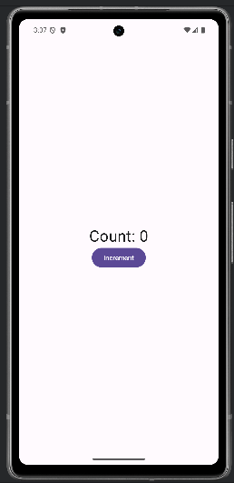

author: shogo.yamada
summary: 「単体テストの考え方/使い方」という本から作成したcolab
id: original_unit_test_colab
categories: codelab,markdown
environments: Web
status: Draft
feedback link: https://github.com/yshogo
analytics account: XXXXXXXX

# Codelab: Jetpack Composeでの単体テスト学習

## はじめに

このCodelabでは、「単体テストの考え方/使い方」という本の内容に基づき、Androidアプリの開発における単体テストの基礎を学びます。本Codelabでは特に、Jetpack Composeを用いたサンプルコードを使用して、実際にどのようにテストを実装するかを解説していきます。


<aside class="negative">
注意：
このCodelabは著者山田の解釈を元に作成されていますが、必ずしも本の内容を網羅しているわけではありません。
また、解釈に誤りが含まれている可能性もあります。そのため、このCodelabを通じて基本的な理解を深めるだけでなく、必ず原書も併せてお読みいただき、より深い理解を得ていただくことを推奨します。
</aside>

### 目的

このCodelabの目的は、Jetpack Composeを活用したテストの実装方法を学ぶことです。基本的なテストの考え方を学ぶだけでなく、実際の開発にすぐに応用できるテクニックも紹介します。

### 対象読者

- Android開発に携わっている方
- 単体テストの基本的な概念を学びたい方

### 前提条件

- Android開発環境が整っていること
- Kotlinの基本的な知識があること
- Jetpack Composeの基本的な使い方を理解していること

### 必要なもの
- Android 開発に関する基本的な知識
- Android Studio（まだお持ちでない場合は[こちら](https://developer.android.com/studio/?hl=ja)からダウンロードしてください）
- Android Emulator または Android デバイス（Android Studio から入手可能）
- サンプルコード（次の手順を参照）

## Step 1: プロジェクトセットアップ
概要: シンプルなカウンターアプリを作成します。ボタンを押すたびにカウントが増加し、テキスト表示が更新されます。



### GitHub からクローンを作成する
GitHub からこの Codelab のクローンを作成するには、次のコマンドを実行します。

```
git clone https://github.com/yshogo/unit-test-codelab-sample.git
cd unittestcodelabsample
git checkout master
```

#### 概要
シンプルなカウンターアプリを作成します。このアプリでは、ボタンを押すたびにカウントが増加し、テキスト表示が更新されるようになっています。 

#### 主なクラス

- **CounterViewModel**: カウントロジックを管理するViewModel
- **CounterScreen**: Jetpack Composeでカウント表示とボタンを実装

#### 次のステップ
次のステップでは、このカウンターアプリの increment() メソッドに対する単体テストを実装し、その動作を検証していきます。

## Step 2: 単体テストの目的
ソフトウェア開発において、単体テストの第一の目的はコード設計を改善することではなく、プロジェクトを**持続可能**なものにすることです。この「持続可能性」が重要な理由は、ソフトウェアは新しい機能や変更が加わるごとに自然と複雑さが増していき、保守性が低下しやすくなるためです。この複雑化（エントロピー）の進行を防ぐために、単体テストはコードの変更が意図しない影響を与えていないかを確認する「セーフティネット」としての役割を果たします。

### ソフトウェアエントロピーと単体テストの役割
**ソフトウェアエントロピー**は、機能追加や改良を行うたびにコードが複雑化し、保守が難しくなる現象を指します。単体テストはこのエントロピーを防ぎ、コードが安定した状態を保つことに貢献します。単体テストの準備には初期の労力が必要ですが、その労力は後々のデバッグや修正の回数を減らすことで、開発効率と保守性を向上させます。


<aside class="positive">
例え話

単体テストは、部屋の大掃除に似ています。最初に時間をかけて徹底的に整理整頓するのは大変ですが、きちんと片付けをしておけば、後々は少しの手間で綺麗な状態を維持できるようになります。同様に、プロジェクトに最初から十分な単体テストを導入することで、最初は時間と労力が必要でも、長期的にはコードの保守が格段に楽になります。例えば、プロダクションコードのリファクタリング時にテストコードも見直し、テストが失敗した際はその原因をすぐに修正するなどの作業を通じて、テストの価値が維持され、コード全体の品質も安定します。しかし、適切なテスト設計やメンテナンスを怠ると、まるで片付けが進まない部屋のように、コードも複雑さとエラーが蓄積し、最終的にはプロジェクト全体が重荷になってしまうのです。
</aside>

### 単体テストの価値と保守コストのバランス

単体テストは、コードの品質を保ちながら開発を進める上で重要ですが、テストの価値を発揮するためには単体テストの価値と保守コストの両方を考慮しなければなりません。
そしてこのコストは下記に挙げるさまざまな作業で費やされる時間が積み重なることで増加していきます。

- プロダクションコードのリファクタリングに伴ってテスト・コードをリファクタリングすること
- プロダクションコードを変更するたびにテストを実施すること
- テストが間違って失敗した際にその対処をすること
- プロダクションコードがどのように振る舞うのかを理解するためにテストコードを読むこと

これらの要点を押さえて、テストスイートを設計することで、持続可能でプロジェクト全体に貢献する価値あるテストを設計することができます。
作成した単体テストへの保守コストがあまりにもかかりすぎると、その単体テストの価値がなくなってしまう、もしくはマイナスになってしまうことがあります。

### コードカバレッジとテストの質
コードカバレッジ（テスト実行中に実行されるコード行の割合）は、テストスイートの品質を測る指標として使用されることが多いですが、**カバレッジだけではテストの質は保証できません**。カバレッジに過度にこだわると、カバレッジを上げるためだけに表面的なテストや冗長なテストを書く傾向が生まれることがあります。良質なテストは、カバレッジに頼るのではなく、ビジネスロジックのように失敗の影響が大きい部分に焦点を当てるべきです。

### 優れたテストスイートの特徴
優れたテストスイートには以下の特徴があります：

- **開発サイクルに統合されている**：テストは開発プロセスに組み込まれ、後付けではありません。
- **コードベースの特に重要な部分のみがテスト対象となっている**：特にビジネスロジックなどを含む部分（ドメイン・モデル）に重点を置いたテストが行われる。
  - インフラに関するコード
  - 外部サービスや依存関係にあるもの（例：データベースやサード・パーティのシステム）
- **最小限の保守コストで最大限の価値を発揮する**：テストがプロジェクト全体に持続可能な成長をもたらすよう工夫されている。

このように設計された単体テストによって、コードベースの複雑化を抑えながら、プロジェクト全体が安心して成長できる基盤を築くことができます。

### 次のステップ
次のステップでは、単体テストの書き方や考え方の違いを深掘りし、古典学派とロンドン学派という2つの主要なアプローチについて学びます。それぞれのアプローチがどのようにテストの設計に影響を与えるのか、またどのようなケースで適用するのが効果的かを見ていきましょう。これにより、プロジェクトの特性や要件に応じた適切なテスト手法の選択ができるようになります。

## Step 3: 単体テストの学派（古典 vs ロンドン）
内容: ロンドン学派と古典学派の違いを示します。ロンドン学派ではViewModelをモック化してテスト。

## Step 4: 単体テストの構造とAAAパターン
内容: Arrange-Act-Assert（AAA）パターンでのテスト構造を示し、コードを一貫性のある構造にします。

## Step 5: 良いテストの4本の柱
内容: CounterScreenのUIテストで状態が正しく表示されているか確認し、リファクタリング耐性と保守性について学びます。

## Step 6: テストダブルの活用
内容: モックとスタブの違いを理解し、ログを持つViewModelのテストでモック化を体験します。

## Step 7: 単体テストの3つの手法
内容: 出力値ベース、状態ベース、コミュニケーションベースの3つのテスト手法を示します。

## Step 8: 複雑なコードのリファクタリング
内容: ViewModelに履歴機能を持たせ、ビジネスロジックとUIの分離を学びます。

## Step 9: 完成形とまとめ
完成形コード: 最終的なCounterアプリとテストコードを確認します。
まとめ: テストの基本原則とJetpack Compose特有のUIテストの利点を確認し、リファクタリング耐性と保守性について学びます。
